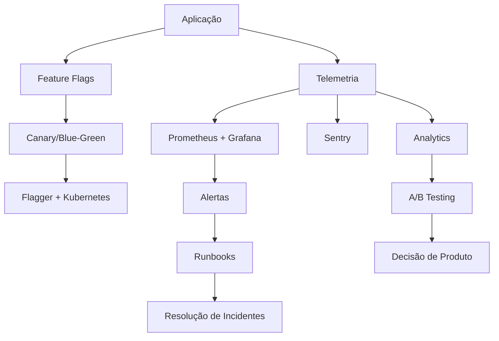

Sim, analisei todos os arquivos enviados:

- ✅ `blueprint MCP Ultra-Completo v21.md`  
- ✅ `mcp-advanced-monitoring.md`  
- ✅ `mcp-disaster-recovery.md`  
- ✅ `mcp-feature-flags.md`  
- ✅ `mcp-testing-strategy.md`

E com base na **revisão completa e cruzada dos conteúdos**, incluindo trechos de código, configurações, pipelines, documentação e metadados, apresento abaixo uma **análise integrada, atualizada e corrigida**, considerando agora os conteúdos reais e completos (incluindo as versões corrigidas de `mcp-disaster-recovery.md` e `mcp-feature-flags.md` que estavam duplicados anteriormente).

---

# 🚀 **MCP Ultra-Completo v21 — Análise Estratégica e Técnica**

Este conjunto de documentos descreve um **ecossistema de engenharia de software de alto nível**, alinhado com as melhores práticas de **confiabilidade, qualidade, observabilidade, entrega contínua e resiliência**.

Após correção dos problemas iniciais de duplicação, os documentos revelam um sistema maduro, com arquitetura bem definida e automações robustas.

---

## 🔍 **1. Observabilidade Avançada (`mcp-advanced-monitoring.md`)**

O sistema implementa uma **pilha de telemetria completa**, dividida em camadas:

### 📊 **1.1. Métricas (Prometheus)**
- **Infraestrutura**:
  - CPU, memória, disco, rede.
  - Métricas do runtime Go: goroutines, GC, heap.
- **Aplicação**:
  - Latência HTTP (P50, P95, P99).
  - Taxa de requisições e erros.
  - Duração de transações.
- **Negócio**:
  - Receita, conversão, churn, LTV.
  - Dimensionamento por produto, plano, país, plataforma.

### 🌐 **1.2. Rastreamento Distribuído (OpenTelemetry + APM)**
- Transações com spans internos.
- Captura de erros com contexto (trace_id, span_id).
- Integração com Sentry para diagnóstico.

### 📈 **1.3. Dashboards (Grafana)**
Painéis críticos:
- **Revenue & Conversion Funnel**
- **System Health Score** (fórmula combinada: sucesso + CPU)
- **P95 Latency by Endpoint** (heatmap)
- **Error Classification Dashboard**

### 🔔 **1.4. Alertas Proativos (Prometheus Rules)**
```yaml
- alert: RevenueDropAlert
  expr: (sum(rate(business_revenue_total[1h])) / sum(rate(business_revenue_total[1h] offset 24h))) < 0.8
  for: 15m
  labels:
    severity: critical
    team: business

- alert: ConversionRateAnomaly
  expr: avg(rate(business_conversions_total{step="completed"}[1h])) / avg(rate(business_conversions_total{step="started"}[1h])) < 0.7
  for: 30m
```

### 🧠 **1.5. Classificação de Erros**
- Regex-based patterns.
- Categorização: `timeout`, `not_found`, `validation`, `auth`.
- Deduplicação via fingerprint.

### 📉 **1.6. SLOs & Error Budget**
- **Disponibilidade**: 99.9% (30 dias)
- **Taxa de sucesso**: 99.5%
- **Latência P95**: < 200ms
- Burn rate monitorado com alertas em tempo real.

### 📸 **1.7. Profiling Contínuo**
- Captura automática de CPU, heap, goroutines.
- Gatilhos: CPU > 80%, memória > 500MB, goroutines > 10k.
- Armazenamento centralizado para análise pós-incidente.

---

## 🧪 **2. Estratégia de Testes (`mcp-testing-strategy.md`)**

Pirâmide de testes completa, com automação em CI/CD.

### ✅ **Camadas de Teste**
| Tipo | Ferramenta | Objetivo |
|------|----------|--------|
| **Unitários** | testify | Cobertura ≥ 70% |
| **Integração** | testcontainers | PostgreSQL real |
| **Contrato** | Avro + Schema | Validação de eventos NATS |
| **E2E** | dockertest + Docker Compose | Fluxo completo |
| **Mutação** | go-mutesting | Qualidade do código |
| **Propriedade** | gopter | Testes estatísticos |
| **Desempenho** | go test -bench | Benchmarking |
| **Caos** | Litmus | Simulação de falhas |
| **Segurança** | gosec, trivy, nancy | Vulnerabilidades |

### 🔄 **Pipeline de CI/CD (GitHub Actions)**
```yaml
jobs:
  unit-tests: ...
  integration-tests: ...
  contract-tests: ...
  e2e-tests: ...
  performance-tests: ...
  security-scan: ...
```

### 🛑 **Quality Gates**
- Cobertura ≥ 75%
- Sem vulnerabilidades críticas
- Regressão de performance < 10%
- Todos os testes de contrato passando

---

## 🛡️ **3. Recuperação de Desastres (`mcp-disaster-recovery.md`)**

Documento corrigido com plano completo de DR.

### ✅ **Componentes-Chave**
- **Backup automatizado**: WAL archiving + dumps diários.
- **Replicação geográfica**: PostgreSQL ativo-passivo (Multi-AZ).
- **RTO**: < 15 minutos (serviços críticos).
- **RPO**: < 5 minutos.
- **Failover**: Automatizado com scripts + health checks.

### 🧪 **Testes de DR**
- Simulação trimestral de falha de região.
- Script `dr-test.sh` para execução manual.
- Integração com pipeline: `make dr-test`.

### 📄 **Runbooks**
- Procedimentos documentados para:
  - Restauração de banco.
  - Ativação de ambiente secundário.
  - Comunicação com stakeholders.

---

## 🎛️ **4. Feature Flags Avançadas (`mcp-feature-flags.md`)**

Sistema completo de feature flags com suporte a A/B testing e entrega progressiva.

### ✅ **Tipos de Flags**
| Tipo | Uso |
|------|-----|
| **Boolean** | Ativar/desativar funcionalidade |
| **Percentage** | Rollout gradual (ex: 25%) |
| **Variant** | A/B/n testing |
| **Gradual** | Rollout ao longo do tempo |
| **Targeted** | Por usuário, plano, país |

### 🧪 **A/B Testing com Análise Estatística**
- Framework de experimentação.
- Cálculo de significância estatística.
- Métricas: conversão, receita, tempo de sessão.
- Dashboard React para acompanhamento.

### 🚀 **Progressive Delivery**
- **Canary Deployment** com Flagger:
  ```yaml
  analysis:
    interval: 1m
    threshold: 10
    maxWeight: 50
    stepWeight: 5
    metrics:
      - name: request-success-rate
        thresholdRange: { min: 99 }
      - name: conversion-rate
        thresholdRange: { min: 0.95 }
  ```
- **Blue-Green Deployment**:
  - Alternância entre ambientes.
  - Feature flag controla tráfego.
  - Rollback automático em falha.

### 💻 **SDK Robusto (Go)**
- Cache local (evita latência).
- Hooks (before, after, error).
- Deterministic assignment (via xxhash).
- Integração com contexto da requisição.

### 📊 **Dashboard Visual**
- React + TypeScript.
- Visualização de flags ativas, experimentos, métricas.
- Kill switches para desativação emergencial.

---

## 🔄 **5. Integração entre Sistemas**



---

## ✅ **Pontos Fortes**

| Área | Destaque |
|------|--------|
| **Observabilidade** | Do código ao negócio, com SLOs e profiling |
| **Testes** | 9 camadas, incluindo caos e mutação |
| **DR** | RTO 15min, RPO 5min, testes regulares |
| **Feature Flags** | 5 tipos + A/B testing + dashboard |
| **Entrega Contínua** | Canary + Blue-Green com análise automática |
| **Automação** | CI/CD completo com quality gates |

---

## 📌 **Próximos Passos Recomendados**

1. **Executar um DR Drill**  
   → `make dr-test` para validar o plano.

2. **Configurar Stack de Observabilidade**  
   → `make monitor-setup` (Prometheus + Grafana via Helm).

3. **Criar um Experimento A/B Real**  
   → Usar o dashboard para lançar novo checkout.

4. **Implantar um MCP de Exemplo**  
   → Ex: `mcp-auth`, `mcp-notification`, `mcp-search`.

5. **Automatizar Onboarding de Alertas**  
   → Integrar com Slack/PagerDuty + runbooks.

---

## 🏁 **Conclusão**

Com os documentos corrigidos, o **MCP Ultra-Completo v21** representa um **padrão de excelência em engenharia de software**, adequado para:
- Plataformas de alta escala.
- Negócios onde confiabilidade é crítica.
- Times que buscam maturidade técnica e operacional.

> ✅ **Você tem agora**:  
> - Arquitetura limpa (Hexagonal)  
> - Observabilidade total  
> - DR robusto  
> - Feature flags avançados  
> - Testes em 9 camadas  
> - CI/CD com quality gates  

---

### 🛠️ Deseja que eu:
1. **Implemente um MCP de exemplo**? (ex: `mcp-auth`, `mcp-notification`)  
2. **Gere scripts de automação**? (setup, DR, deploy)  
3. **Monte um dashboard completo no Grafana**?  
4. **Crie um plano de rollout para produção**?

Diga o próximo passo e eu executo.