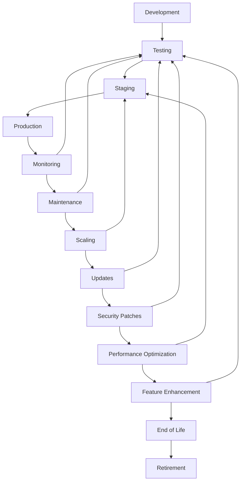
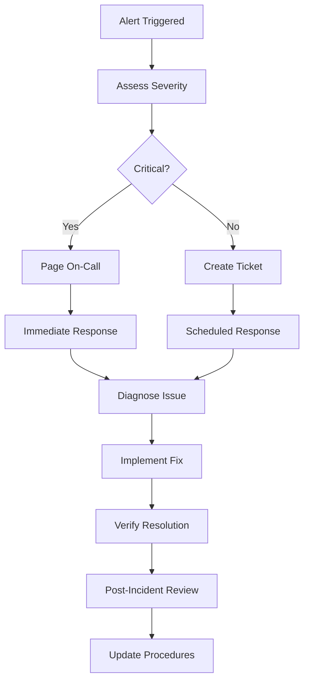

# 🔄 MCP Ultra - Lifecycle Management Guide

## Overview

This comprehensive guide covers application lifecycle management for MCP Ultra, including deployment strategies, monitoring, maintenance, scaling, and operations management. It provides end-to-end guidance for managing the complete lifecycle of the microservice from development to production retirement.

## Table of Contents

1. [Lifecycle Overview](#lifecycle-overview)
2. [Development Lifecycle](#development-lifecycle)
3. [Deployment Strategies](#deployment-strategies)
4. [Monitoring & Observability](#monitoring--observability)
5. [Maintenance & Operations](#maintenance--operations)
6. [Scaling & Performance](#scaling--performance)
7. [Security Management](#security-management)
8. [Backup & Disaster Recovery](#backup--disaster-recovery)
9. [Compliance & Governance](#compliance--governance)
10. [Retirement Strategy](#retirement-strategy)

## Lifecycle Overview

### Application Lifecycle Stages



### Key Lifecycle Metrics

| Stage | Key Metrics | Target Values |
|-------|-------------|---------------|
| **Development** | Code Coverage, Build Time | >95%, <5min |
| **Testing** | Test Pass Rate, Bug Detection | >99%, High |
| **Staging** | Performance, Compatibility | Production-like |
| **Production** | Uptime, Response Time, Errors | >99.9%, <100ms, <0.1% |
| **Monitoring** | Alert Response, MTTR | <5min, <30min |
| **Maintenance** | Patch Application, Security Updates | Weekly, Critical: 24h |

## Development Lifecycle

### 1. Development Environment Setup

#### Local Development Environment
```bash
# Clone and setup development environment
git clone https://github.com/vertikon/mcp-ultra.git
cd mcp-ultra

# Install dependencies and tools
make setup
make dev-deps

# Setup local services
docker-compose up -d postgres redis nats prometheus grafana jaeger

# Configure environment
cp .env.example .env
# Edit .env with development values

# Run in development mode
make dev
```

#### Development Workflow
```bash
# 1. Create feature branch
git checkout -b feature/new-feature

# 2. Develop with hot reload
make dev

# 3. Run tests continuously
make test-watch

# 4. Check code quality
make lint
make security-scan

# 5. Commit changes
git add .
git commit -m "feat: add new feature with comprehensive tests"

# 6. Push and create PR
git push -u origin feature/new-feature
gh pr create --title "feat: add new feature" --body "Description of changes"
```

### 2. Code Quality Gates

#### Pre-commit Hooks
```bash
# Install pre-commit hooks
make install-hooks

# Manual pre-commit check
make pre-commit
```

#### Quality Checklist
- [ ] **Code Coverage**: >95% line coverage
- [ ] **Linting**: No golangci-lint errors
- [ ] **Security**: No gosec critical issues
- [ ] **Vulnerabilities**: No known vulnerabilities
- [ ] **Tests**: All tests pass
- [ ] **Documentation**: Updated for new features
- [ ] **Performance**: No performance regressions

### 3. Continuous Integration

#### CI Pipeline Stages
```yaml
# .github/workflows/ci.yml
stages:
  - name: "Unit Tests"
    parallel: true
    matrix: ["go-1.21", "go-1.22"]
    services: ["postgres", "redis", "nats"]
    
  - name: "Code Quality"
    checks: ["lint", "security-scan", "vulnerability-check"]
    
  - name: "Integration Tests"
    environment: "staging-like"
    dependencies: ["postgres", "redis", "nats"]
    
  - name: "Security Tests"
    scans: ["SAST", "DAST", "dependency-check"]
    
  - name: "Build"
    artifacts: ["binary", "container-image"]
    platforms: ["linux/amd64", "linux/arm64"]
```

## Deployment Strategies

### 1. Environment Progression

#### Environment Pipeline
```
Development → Feature Branch → Integration → Staging → Pre-production → Production
```

#### Environment Configuration
```bash
# Development
export ENVIRONMENT=development
export LOG_LEVEL=debug
export OTEL_TRACES_SAMPLER_ARG=1.0  # 100% sampling

# Staging
export ENVIRONMENT=staging
export LOG_LEVEL=info
export OTEL_TRACES_SAMPLER_ARG=0.1  # 10% sampling

# Production
export ENVIRONMENT=production
export LOG_LEVEL=warn
export OTEL_TRACES_SAMPLER_ARG=0.01  # 1% sampling
```

### 2. Deployment Patterns

#### Blue-Green Deployment
```yaml
apiVersion: argoproj.io/v1alpha1
kind: Rollout
metadata:
  name: mcp-ultra
spec:
  strategy:
    blueGreen:
      activeService: mcp-ultra-active
      previewService: mcp-ultra-preview
      autoPromotionEnabled: false
      prePromotionAnalysis:
        templates:
        - templateName: success-rate
        args:
        - name: service-name
          value: mcp-ultra-preview
      postPromotionAnalysis:
        templates:
        - templateName: success-rate
        args:
        - name: service-name
          value: mcp-ultra-active
```

#### Canary Deployment
```yaml
apiVersion: argoproj.io/v1alpha1
kind: Rollout
metadata:
  name: mcp-ultra
spec:
  strategy:
    canary:
      steps:
      - setWeight: 10
      - pause: {duration: 10m}
      - analysis:
          templates:
          - templateName: success-rate
      - setWeight: 50
      - pause: {duration: 10m}
      - analysis:
          templates:
          - templateName: success-rate
      - setWeight: 100
      maxSurge: "25%"
      maxUnavailable: 0
```

#### Rolling Deployment
```yaml
apiVersion: apps/v1
kind: Deployment
metadata:
  name: mcp-ultra
spec:
  strategy:
    type: RollingUpdate
    rollingUpdate:
      maxSurge: 1
      maxUnavailable: 0
  template:
    spec:
      containers:
      - name: mcp-ultra
        image: mcp-ultra:latest
        readinessProbe:
          httpGet:
            path: /healthz
            port: 9655
          initialDelaySeconds: 10
          periodSeconds: 5
        livenessProbe:
          httpGet:
            path: /live
            port: 9655
          initialDelaySeconds: 30
          periodSeconds: 10
```

### 3. Deployment Automation

#### GitOps Workflow
```bash
# 1. Code changes trigger CI
git push origin main

# 2. CI builds and publishes artifacts
# - Container images
# - Helm charts
# - Binary releases

# 3. GitOps controller detects changes
# - ArgoCD syncs applications
# - Flux reconciles configurations

# 4. Deployment progression
# - Automatic to staging
# - Manual approval for production
# - Rollback capability maintained
```

## Monitoring & Observability

### 1. Observability Stack

#### Metrics Collection (Prometheus)
```yaml
# Prometheus configuration
global:
  scrape_interval: 15s
  evaluation_interval: 15s

scrape_configs:
  - job_name: 'mcp-ultra'
    static_configs:
      - targets: ['mcp-ultra:9656']
    metrics_path: /metrics
    scrape_interval: 10s
```

#### Key Application Metrics
```go
// Business metrics
var (
    requestsTotal = prometheus.NewCounterVec(
        prometheus.CounterOpts{
            Name: "mcp_ultra_requests_total",
            Help: "Total number of requests",
        },
        []string{"method", "endpoint", "status"},
    )
    
    requestDuration = prometheus.NewHistogramVec(
        prometheus.HistogramOpts{
            Name: "mcp_ultra_request_duration_seconds",
            Help: "Request duration in seconds",
            Buckets: prometheus.DefBuckets,
        },
        []string{"method", "endpoint"},
    )
    
    activeConnections = prometheus.NewGauge(
        prometheus.GaugeOpts{
            Name: "mcp_ultra_active_connections",
            Help: "Number of active connections",
        },
    )
)
```

#### Distributed Tracing (Jaeger)
```go
// Tracing configuration
func initTracing() (*sdktrace.TracerProvider, error) {
    exporter, err := jaeger.New(jaeger.WithCollectorEndpoint(
        jaeger.WithEndpoint(os.Getenv("JAEGER_ENDPOINT")),
    ))
    if err != nil {
        return nil, err
    }
    
    tp := sdktrace.NewTracerProvider(
        sdktrace.WithBatcher(exporter),
        sdktrace.WithResource(resource.NewWithAttributes(
            semconv.SchemaURL,
            semconv.ServiceName("mcp-ultra"),
            semconv.ServiceVersion("1.0.0"),
        )),
        sdktrace.WithSampler(sdktrace.TraceIDRatioBased(0.01)),
    )
    
    otel.SetTracerProvider(tp)
    return tp, nil
}
```

### 2. Alerting Rules

#### Critical Alerts
```yaml
# prometheus-rules.yaml
groups:
- name: mcp-ultra-critical
  rules:
  - alert: ServiceDown
    expr: up{job="mcp-ultra"} == 0
    for: 1m
    labels:
      severity: critical
    annotations:
      summary: "MCP Ultra service is down"
      
  - alert: HighErrorRate
    expr: rate(mcp_ultra_requests_total{status=~"5.."}[5m]) > 0.05
    for: 2m
    labels:
      severity: critical
    annotations:
      summary: "High error rate detected"
      
  - alert: HighLatency
    expr: histogram_quantile(0.95, rate(mcp_ultra_request_duration_seconds_bucket[5m])) > 0.5
    for: 5m
    labels:
      severity: warning
    annotations:
      summary: "High latency detected"
```

#### Alert Management
```bash
# Configure alert routing
# alertmanager.yml
route:
  group_by: ['alertname', 'cluster', 'service']
  group_wait: 10s
  group_interval: 10s
  repeat_interval: 1h
  receiver: 'default'
  routes:
  - match:
      severity: critical
    receiver: 'critical-alerts'
    
receivers:
- name: 'default'
  slack_configs:
  - api_url: '${SLACK_WEBHOOK_URL}'
    channel: '#alerts'
    
- name: 'critical-alerts'
  pagerduty_configs:
  - routing_key: '${PAGERDUTY_KEY}'
  slack_configs:
  - api_url: '${SLACK_WEBHOOK_URL}'
    channel: '#critical-alerts'
```

### 3. Dashboards

#### Grafana Dashboard Configuration
```json
{
  "dashboard": {
    "title": "MCP Ultra - Application Overview",
    "panels": [
      {
        "title": "Request Rate",
        "type": "graph",
        "targets": [
          {
            "expr": "rate(mcp_ultra_requests_total[5m])",
            "legendFormat": "{{method}} {{endpoint}}"
          }
        ]
      },
      {
        "title": "Error Rate",
        "type": "stat",
        "targets": [
          {
            "expr": "rate(mcp_ultra_requests_total{status=~\"5..\"}[5m]) / rate(mcp_ultra_requests_total[5m]) * 100"
          }
        ]
      },
      {
        "title": "Response Time",
        "type": "graph",
        "targets": [
          {
            "expr": "histogram_quantile(0.95, rate(mcp_ultra_request_duration_seconds_bucket[5m]))",
            "legendFormat": "95th percentile"
          },
          {
            "expr": "histogram_quantile(0.50, rate(mcp_ultra_request_duration_seconds_bucket[5m]))",
            "legendFormat": "50th percentile"
          }
        ]
      }
    ]
  }
}
```

## Maintenance & Operations

### 1. Regular Maintenance Tasks

#### Daily Operations
```bash
#!/bin/bash
# daily-maintenance.sh

echo "🔍 Daily Maintenance - $(date)"

# Check service health
echo "Checking service health..."
curl -f http://mcp-ultra:9655/healthz || echo "⚠️ Health check failed"

# Check resource usage
echo "Checking resource usage..."
kubectl top pods -l app=mcp-ultra

# Check logs for errors
echo "Checking for errors..."
kubectl logs -l app=mcp-ultra --since=24h | grep -i error | tail -10

# Check certificate expiration
echo "Checking certificate expiration..."
openssl x509 -in /etc/ssl/certs/mcp-ultra.crt -noout -dates

# Database maintenance
echo "Running database maintenance..."
psql -h $DB_HOST -U $DB_USER -d $DB_NAME -c "ANALYZE;"
```

#### Weekly Operations
```bash
#!/bin/bash
# weekly-maintenance.sh

echo "📊 Weekly Maintenance - $(date)"

# Update dependencies
echo "Checking for dependency updates..."
go list -u -m all

# Security scanning
echo "Running security scans..."
govulncheck ./...
gosec ./...

# Performance metrics review
echo "Reviewing performance metrics..."
# Generate weekly performance report

# Backup verification
echo "Verifying backups..."
# Test backup restoration process

# Log rotation
echo "Rotating logs..."
find /var/log/mcp-ultra -name "*.log" -mtime +7 -delete
```

#### Monthly Operations
```bash
#!/bin/bash
# monthly-maintenance.sh

echo "🗓️ Monthly Maintenance - $(date)"

# Capacity planning review
echo "Reviewing capacity metrics..."
# Analyze resource usage trends

# Security review
echo "Conducting security review..."
# Review access logs, update security policies

# Disaster recovery testing
echo "Testing disaster recovery procedures..."
# Verify backup restoration

# Performance optimization
echo "Analyzing performance..."
# Review and optimize slow queries, endpoints

# Documentation updates
echo "Updating documentation..."
# Review and update operational docs
```

### 2. Automated Maintenance

#### Kubernetes CronJobs
```yaml
apiVersion: batch/v1
kind: CronJob
metadata:
  name: mcp-ultra-daily-maintenance
spec:
  schedule: "0 2 * * *"  # Daily at 2 AM
  jobTemplate:
    spec:
      template:
        spec:
          containers:
          - name: maintenance
            image: mcp-ultra-maintenance:latest
            command:
            - /bin/bash
            - -c
            - |
              echo "Running daily maintenance..."
              /scripts/daily-maintenance.sh
          restartPolicy: OnFailure
```

### 3. Incident Management

#### Incident Response Workflow


#### Incident Severity Levels

| Level | Description | Response Time | Examples |
|-------|-------------|---------------|----------|
| **P0 - Critical** | Service completely down | <15 minutes | Complete outage, data loss |
| **P1 - High** | Major functionality affected | <1 hour | High error rates, performance degradation |
| **P2 - Medium** | Minor functionality affected | <4 hours | Feature not working, minor bugs |
| **P3 - Low** | Cosmetic or enhancement | <24 hours | UI issues, documentation |

#### Runbooks

##### Service Restart Runbook
```bash
#!/bin/bash
# runbook-service-restart.sh

echo "🔄 MCP Ultra Service Restart Runbook"
echo "Executed by: $(whoami) at $(date)"

# 1. Check current status
echo "1. Checking current service status..."
kubectl get pods -l app=mcp-ultra

# 2. Verify health endpoints
echo "2. Checking health endpoints..."
kubectl exec -it $(kubectl get pod -l app=mcp-ultra -o jsonpath='{.items[0].metadata.name}') -- curl -f localhost:9655/healthz

# 3. Graceful restart
echo "3. Performing rolling restart..."
kubectl rollout restart deployment/mcp-ultra

# 4. Wait for rollout
echo "4. Waiting for rollout completion..."
kubectl rollout status deployment/mcp-ultra --timeout=600s

# 5. Verify health
echo "5. Verifying service health..."
sleep 30
curl -f http://mcp-ultra:9655/healthz

echo "✅ Service restart completed successfully"
```

## Scaling & Performance

### 1. Horizontal Scaling

#### Horizontal Pod Autoscaler (HPA)
```yaml
apiVersion: autoscaling/v2
kind: HorizontalPodAutoscaler
metadata:
  name: mcp-ultra-hpa
spec:
  scaleTargetRef:
    apiVersion: apps/v1
    kind: Deployment
    name: mcp-ultra
  minReplicas: 3
  maxReplicas: 50
  metrics:
  - type: Resource
    resource:
      name: cpu
      target:
        type: Utilization
        averageUtilization: 70
  - type: Resource
    resource:
      name: memory
      target:
        type: Utilization
        averageUtilization: 80
  - type: Pods
    pods:
      metric:
        name: mcp_ultra_requests_per_second
      target:
        type: AverageValue
        averageValue: "1000"
  behavior:
    scaleUp:
      stabilizationWindowSeconds: 60
      policies:
      - type: Percent
        value: 100
        periodSeconds: 15
    scaleDown:
      stabilizationWindowSeconds: 300
      policies:
      - type: Percent
        value: 10
        periodSeconds: 60
```

#### Vertical Pod Autoscaler (VPA)
```yaml
apiVersion: autoscaling.k8s.io/v1
kind: VerticalPodAutoscaler
metadata:
  name: mcp-ultra-vpa
spec:
  targetRef:
    apiVersion: apps/v1
    kind: Deployment
    name: mcp-ultra
  updatePolicy:
    updateMode: "Auto"
  resourcePolicy:
    containerPolicies:
    - containerName: mcp-ultra
      minAllowed:
        cpu: 100m
        memory: 128Mi
      maxAllowed:
        cpu: 2
        memory: 2Gi
      controlledResources: ["cpu", "memory"]
```

### 2. Performance Optimization

#### Database Optimization
```sql
-- Connection pooling configuration
-- postgresql.conf
max_connections = 200
shared_buffers = 256MB
effective_cache_size = 1GB
work_mem = 4MB
maintenance_work_mem = 64MB
checkpoint_completion_target = 0.9
wal_buffers = 16MB
default_statistics_target = 100

-- Query optimization
CREATE INDEX CONCURRENTLY idx_users_email ON users(email);
CREATE INDEX CONCURRENTLY idx_orders_status_created ON orders(status, created_at);

-- Regular maintenance
VACUUM ANALYZE;
REINDEX DATABASE mcp_ultra;
```

#### Redis Optimization
```bash
# redis.conf
maxmemory 512mb
maxmemory-policy allkeys-lru
save 900 1
save 300 10
save 60 10000
tcp-keepalive 300
timeout 300
```

#### Application Performance Tuning
```go
// Connection pool optimization
func initDB() *sql.DB {
    db, err := sql.Open("postgres", os.Getenv("DATABASE_URL"))
    if err != nil {
        log.Fatal(err)
    }
    
    // Optimize connection pool
    db.SetMaxOpenConns(25)
    db.SetMaxIdleConns(25)
    db.SetConnMaxLifetime(5 * time.Minute)
    
    return db
}

// Context with timeout for all operations
func (s *Service) GetUser(ctx context.Context, id string) (*User, error) {
    ctx, cancel := context.WithTimeout(ctx, 5*time.Second)
    defer cancel()
    
    return s.repo.GetUser(ctx, id)
}

// Implement circuit breaker
func (s *Service) callExternalService(ctx context.Context) error {
    return s.circuitBreaker.Execute(func() error {
        return s.externalClient.Call(ctx)
    })
}
```

### 3. Load Testing

#### Load Test Configuration
```javascript
// k6 load test
import http from 'k6/http';
import { check, sleep } from 'k6';

export let options = {
  stages: [
    { duration: '2m', target: 100 },   // Ramp up
    { duration: '5m', target: 100 },   // Sustained load
    { duration: '2m', target: 200 },   // Ramp up further
    { duration: '5m', target: 200 },   // Higher sustained load
    { duration: '2m', target: 0 },     // Ramp down
  ],
  thresholds: {
    http_req_duration: ['p(95)<500'],  // 95% under 500ms
    http_req_failed: ['rate<0.01'],    // Error rate under 1%
  },
};

export default function () {
  const response = http.get('http://mcp-ultra:9655/healthz');
  check(response, {
    'status is 200': (r) => r.status === 200,
    'response time < 100ms': (r) => r.timings.duration < 100,
  });
  sleep(1);
}
```

## Security Management

### 1. Security Lifecycle

#### Security Controls
```bash
# Daily security checks
#!/bin/bash

echo "🔒 Daily Security Checks - $(date)"

# 1. Certificate expiration monitoring
openssl x509 -in /etc/ssl/certs/mcp-ultra.crt -noout -checkend 2592000
if [ $? -ne 0 ]; then
    echo "⚠️ Certificate expires within 30 days"
fi

# 2. Vulnerability scanning
govulncheck ./...

# 3. Security policy compliance
kubectl get pods -l app=mcp-ultra -o jsonpath='{.items[*].spec.securityContext}'

# 4. Access log analysis
grep -i "failed\|error\|unauthorized" /var/log/mcp-ultra/access.log | tail -20

# 5. Network security
netstat -tulnp | grep :9655
```

#### Security Updates
```bash
# Automated security patching
#!/bin/bash

echo "🔧 Security Update Process"

# 1. Check for security updates
go list -u -m all | grep -i security

# 2. Test updates in staging
kubectl config use-context staging
kubectl set image deployment/mcp-ultra mcp-ultra=mcp-ultra:security-patch

# 3. Run security tests
make security-test

# 4. Deploy to production if tests pass
if [ $? -eq 0 ]; then
    kubectl config use-context production
    kubectl set image deployment/mcp-ultra mcp-ultra=mcp-ultra:security-patch
    echo "✅ Security patch deployed successfully"
else
    echo "❌ Security patch failed tests"
fi
```

### 2. Compliance Monitoring

#### LGPD/GDPR Compliance
```bash
# Data compliance audit
#!/bin/bash

echo "📋 LGPD/GDPR Compliance Audit - $(date)"

# 1. Data inventory
psql -h $DB_HOST -U $DB_USER -d $DB_NAME -c "
SELECT 
    table_name,
    column_name,
    data_type,
    CASE 
        WHEN column_name ILIKE '%email%' OR column_name ILIKE '%phone%' 
        THEN 'PII'
        ELSE 'Regular'
    END as data_classification
FROM information_schema.columns 
WHERE table_schema = 'public'
ORDER BY table_name, column_name;
"

# 2. Data retention compliance
echo "Checking data retention policies..."
python3 scripts/check_data_retention.py

# 3. Consent tracking
echo "Verifying consent records..."
psql -h $DB_HOST -U $DB_USER -d $DB_NAME -c "
SELECT 
    COUNT(*) as total_consents,
    COUNT(CASE WHEN consent_given = true THEN 1 END) as active_consents
FROM user_consents 
WHERE created_at >= NOW() - INTERVAL '30 days';
"

# 4. Data anonymization status
echo "Checking anonymization..."
python3 scripts/verify_anonymization.py
```

## Backup & Disaster Recovery

### 1. Backup Strategy

#### Database Backups
```bash
#!/bin/bash
# database-backup.sh

BACKUP_DATE=$(date +%Y%m%d_%H%M%S)
BACKUP_DIR="/backups/mcp-ultra"
DB_NAME="mcp_ultra"

echo "📦 Starting database backup - $BACKUP_DATE"

# 1. Full backup
pg_dump -h $DB_HOST -U $DB_USER -d $DB_NAME \
    --verbose \
    --format=custom \
    --compress=9 \
    --file="$BACKUP_DIR/full_backup_$BACKUP_DATE.dump"

# 2. Schema-only backup
pg_dump -h $DB_HOST -U $DB_USER -d $DB_NAME \
    --schema-only \
    --file="$BACKUP_DIR/schema_backup_$BACKUP_DATE.sql"

# 3. Upload to cloud storage
aws s3 cp "$BACKUP_DIR/full_backup_$BACKUP_DATE.dump" \
    "s3://mcp-ultra-backups/database/" \
    --storage-class STANDARD_IA

# 4. Cleanup old backups (keep 30 days)
find $BACKUP_DIR -name "*.dump" -mtime +30 -delete

echo "✅ Database backup completed successfully"
```

#### Application State Backup
```bash
#!/bin/bash
# application-backup.sh

BACKUP_DATE=$(date +%Y%m%d_%H%M%S)

echo "💾 Application State Backup - $BACKUP_DATE"

# 1. Configuration backup
kubectl get configmaps -l app=mcp-ultra -o yaml > "config_backup_$BACKUP_DATE.yaml"
kubectl get secrets -l app=mcp-ultra -o yaml > "secrets_backup_$BACKUP_DATE.yaml"

# 2. Persistent volume snapshots
kubectl get pvc -l app=mcp-ultra -o json | \
    jq '.items[] | .metadata.name' | \
    xargs -I {} kubectl patch pvc {} -p '{"metadata":{"annotations":{"volume.beta.kubernetes.io/storage-class":"snapshot-enabled"}}}'

# 3. Redis data backup
redis-cli --rdb "/backups/redis/dump_$BACKUP_DATE.rdb"

# 4. Upload to cloud storage
aws s3 sync /backups/ s3://mcp-ultra-backups/application/
```

### 2. Disaster Recovery

#### Recovery Time Objectives (RTO) & Recovery Point Objectives (RPO)

| Component | RTO | RPO | Strategy |
|-----------|-----|-----|----------|
| **Application** | 5 minutes | 1 minute | Multi-zone deployment with load balancer |
| **Database** | 15 minutes | 5 minutes | Master-replica with automated failover |
| **Redis Cache** | 2 minutes | 10 minutes | Redis Cluster with persistence |
| **File Storage** | 10 minutes | 1 hour | Replicated cloud storage |

#### Disaster Recovery Procedures
```bash
#!/bin/bash
# disaster-recovery.sh

echo "🚨 Disaster Recovery Procedure"
echo "Scenario: $1"
echo "Started by: $(whoami) at $(date)"

case $1 in
    "database-failure")
        echo "Handling database failure..."
        
        # 1. Promote replica to primary
        kubectl patch postgresql postgresql-cluster \
            --type merge \
            --patch '{"spec":{"postgresql":{"primary":"postgresql-replica"}}}'
        
        # 2. Update application config
        kubectl patch configmap mcp-ultra-config \
            --patch '{"data":{"DATABASE_HOST":"postgresql-replica"}}'
        
        # 3. Restart application pods
        kubectl rollout restart deployment/mcp-ultra
        ;;
        
    "complete-outage")
        echo "Handling complete outage..."
        
        # 1. Switch to disaster recovery region
        kubectl config use-context dr-cluster
        
        # 2. Restore from backups
        ./restore-from-backup.sh latest
        
        # 3. Update DNS to point to DR
        aws route53 change-resource-record-sets \
            --hosted-zone-id $HOSTED_ZONE_ID \
            --change-batch file://dns-failover.json
        ;;
        
    "data-corruption")
        echo "Handling data corruption..."
        
        # 1. Identify corruption scope
        ./analyze-corruption.sh
        
        # 2. Stop write operations
        kubectl scale deployment mcp-ultra --replicas=0
        
        # 3. Restore from point-in-time backup
        ./restore-database.sh $(date -d "1 hour ago" +%Y%m%d_%H%M%S)
        
        # 4. Verify data integrity
        ./verify-data-integrity.sh
        
        # 5. Resume operations
        kubectl scale deployment mcp-ultra --replicas=3
        ;;
esac

echo "✅ Disaster recovery procedure completed"
```

## Compliance & Governance

### 1. Compliance Framework

#### Audit Logging
```go
// Audit log structure
type AuditLog struct {
    ID        string    `json:"id"`
    Timestamp time.Time `json:"timestamp"`
    UserID    string    `json:"user_id,omitempty"`
    Action    string    `json:"action"`
    Resource  string    `json:"resource"`
    Details   map[string]interface{} `json:"details,omitempty"`
    IPAddress string    `json:"ip_address"`
    UserAgent string    `json:"user_agent,omitempty"`
    Status    string    `json:"status"`
}

// Audit middleware
func AuditMiddleware(next http.Handler) http.Handler {
    return http.HandlerFunc(func(w http.ResponseWriter, r *http.Request) {
        start := time.Now()
        
        // Wrap response writer to capture status
        wrapped := &responseWriter{ResponseWriter: w, statusCode: 200}
        
        next.ServeHTTP(wrapped, r)
        
        // Log audit event
        audit := AuditLog{
            ID:        generateID(),
            Timestamp: start,
            Action:    r.Method,
            Resource:  r.URL.Path,
            IPAddress: getClientIP(r),
            UserAgent: r.UserAgent(),
            Status:    http.StatusText(wrapped.statusCode),
        }
        
        if userID := getUserID(r); userID != "" {
            audit.UserID = userID
        }
        
        logger.Info("audit", zap.Any("audit", audit))
    })
}
```

#### Compliance Monitoring
```bash
#!/bin/bash
# compliance-monitor.sh

echo "📊 Compliance Monitoring Report - $(date)"

# 1. Access control compliance
echo "🔐 Access Control Review"
kubectl auth can-i --list --as=system:serviceaccount:default:mcp-ultra

# 2. Data encryption status
echo "🔒 Encryption Status"
kubectl get secrets -o jsonpath='{.items[*].metadata.annotations.encryption\.status}'

# 3. Network policy compliance
echo "🌐 Network Security"
kubectl get networkpolicies -l app=mcp-ultra

# 4. Resource utilization governance
echo "📈 Resource Governance"
kubectl top nodes
kubectl top pods -l app=mcp-ultra

# 5. Security policy violations
echo "⚠️ Security Violations"
kubectl get pods -o jsonpath='{.items[*].spec.securityContext.runAsRoot}' | grep -c true

# 6. Generate compliance report
python3 scripts/generate_compliance_report.py
```

### 2. Change Management

#### Change Request Process
```yaml
# change-request-template.yaml
apiVersion: v1
kind: ConfigMap
metadata:
  name: change-request-template
data:
  template: |
    # Change Request
    
    ## Change Details
    - **Type**: [Major|Minor|Emergency]
    - **Category**: [Feature|Bugfix|Security|Performance]
    - **Scheduled Date**: YYYY-MM-DD HH:MM
    - **Duration**: Expected duration
    
    ## Impact Assessment
    - **Affected Systems**: List systems
    - **Downtime Expected**: Yes/No
    - **Rollback Plan**: Describe rollback procedure
    
    ## Testing
    - [ ] Unit tests passed
    - [ ] Integration tests passed
    - [ ] Security scan completed
    - [ ] Performance tests passed
    
    ## Approvals
    - [ ] Technical Lead
    - [ ] Security Team (for security changes)
    - [ ] Operations Team
    - [ ] Business Owner (for major changes)
```

## Retirement Strategy

### 1. End-of-Life Planning

#### Deprecation Timeline
```
Phase 1: Deprecation Notice (6 months before EOL)
├── Announce deprecation
├── Document migration path
├── Provide alternative solutions
└── Stop new feature development

Phase 2: Migration Support (3 months)
├── Assist users in migration
├── Provide migration tools
├── Extended support for critical issues
└── Regular security updates only

Phase 3: End-of-Life (Final 3 months)
├── Stop all development
├── Security updates only for critical issues
├── Prepare decommissioning plan
└── Data export/migration tools

Phase 4: Decommissioning
├── Final data export
├── Service shutdown
├── Infrastructure cleanup
└── Documentation archival
```

#### Decommissioning Checklist
```bash
#!/bin/bash
# decommission-service.sh

echo "🔚 Service Decommissioning Checklist"

# 1. Data backup and export
echo "📦 Final data backup..."
./final-backup.sh

# 2. User notification
echo "📧 Notifying users..."
# Send final notification to all users

# 3. Redirect traffic
echo "🔄 Redirecting traffic..."
kubectl patch service mcp-ultra -p '{"spec":{"selector":{"app":"maintenance-page"}}}'

# 4. Stop services
echo "⏹️ Stopping services..."
kubectl scale deployment mcp-ultra --replicas=0

# 5. Clean up resources
echo "🧹 Cleaning up resources..."
kubectl delete deployment,service,configmap,secret -l app=mcp-ultra

# 6. Remove monitoring
echo "📊 Removing monitoring..."
kubectl delete servicemonitor -l app=mcp-ultra

# 7. Archive documentation
echo "📚 Archiving documentation..."
tar -czf mcp-ultra-archive-$(date +%Y%m%d).tar.gz ./docs

# 8. Final report
echo "📋 Generating final report..."
echo "Service mcp-ultra decommissioned on $(date)" > decommission-report.txt

echo "✅ Service decommissioned successfully"
```

## Conclusion

This lifecycle management guide provides comprehensive procedures for managing MCP Ultra throughout its entire lifecycle. Key takeaways:

### ✅ **Lifecycle Coverage**
- **Complete Development Workflow**: From local development to production deployment
- **Deployment Strategies**: Blue-green, canary, and rolling deployment options
- **Monitoring & Observability**: Comprehensive metrics, tracing, and alerting
- **Maintenance Automation**: Daily, weekly, and monthly operational tasks
- **Scaling & Performance**: Auto-scaling and performance optimization strategies

### ✅ **Operational Excellence**
- **Incident Management**: Clear procedures and runbooks for common scenarios
- **Security Management**: Continuous security monitoring and compliance
- **Disaster Recovery**: Comprehensive backup and recovery procedures
- **Compliance Framework**: LGPD/GDPR compliance monitoring and audit trails

### ✅ **Future-Ready**
- **Change Management**: Structured approach to service evolution
- **Capacity Planning**: Proactive resource management and scaling
- **End-of-Life Planning**: Graceful service retirement procedures

**This guide ensures MCP Ultra maintains high availability, security, and performance throughout its operational lifetime while meeting enterprise compliance requirements.**

---

**📋 Next Steps:**
1. Implement monitoring and alerting based on your specific requirements
2. Set up automated maintenance tasks using the provided scripts
3. Establish disaster recovery procedures and test them regularly
4. Create runbooks specific to your deployment environment
5. Train your team on incident response procedures

**Your enterprise microservice is ready for production lifecycle management!** ✨